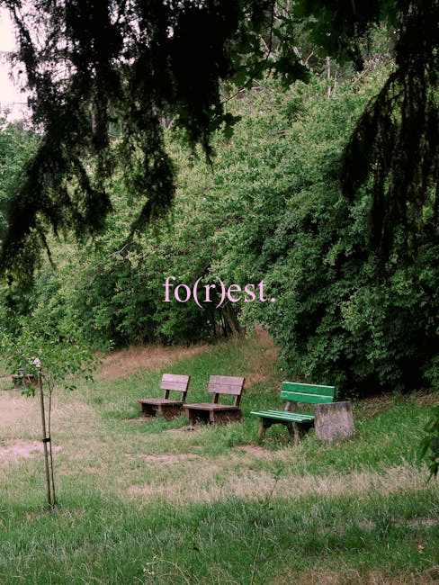

```{r setup, include=FALSE}
knitr::opts_chunk$set(echo=TRUE, message=FALSE, warning=FALSE, error=FALSE)
library(tidyverse)
selected_photos<- read_csv('selected_photos.csv')
```

```{css echo=FALSE}

@import url('https://fonts.googleapis.com/css2?family=Space+Grotesk:wght@300..700&display=swap');

body {
  background-color: white;
  margin-top: 40px;
  margin-left: 24%;   
  margin-right: 24%;
  margin-bottom:50px;
}
h1{
  color:#627D54;
  font-family: serif;
  font-weight: bold;
  text-transform: uppercase;
}
h2 {
  font-family: serif;
  font-weight: bold;
  text-transform: uppercase;
  padding-top:40px;
  padding-bottom:10px;
  color:#7F9F6F;
}

h3,h4 {
  font-family: serif;
  font-weight: bold;
  text-transform: uppercase;
  color:#518171;
}

p {
  padding-top:15px;
  font-size: 17px;
  font-family: sans-serif;
  font-weight: 300;
  padding-bottom:20px;
}

ul {
  font-family: sans-serif;
  font-size: 17px;
  font-weight: 300;
  list-style-type: circle;
}

a {
  color: #5f94b5;
  text-decoration: none;
  font-family: sans-serif;
  font-size: 15px;
  font-weight: 300;
}

a:hover {
  text-decoration: underline;
  color: #31505b;
}

```


## Introduction

I used key word "relaxation spot" to search for photos on pexels.com.
I was initially interested to see what would comes up : indoor cozy space or outdoor peaceful environment, and as a result i discovered as the second word is "spot", most photos that showed up are outdoor spots. <br>
(I also searched "relaxation space" which turns out shows most of the indoor space photos.) 

[The url for my search](https://www.pexels.com/search/relaxation%20spot/)


### Photo features

When I searched for "relaxation spot,"

* Most of the photos returned were large and vertical in orientation. <br>
* They mostly depicted beaches or forests, so green and blue is the dominant color in many of the images. Most photos include comfortable seating such as lounge chairs or hammocks, set against natural backgrounds. <br>
* In terms of engagement, most images had several thousand views, sometimes slightly over ten thousand, but very few likes.

```{r}
selected_photos %>%
  select(url) %>%
  knitr::kable(format = "html", caption = "Selected Photo URLs")
```


## Key features of my selected photos

I selected first 20 photos from my search as a dataset.

```{r}
total_medium_color <- sum(selected_photos$color_group=="medium")
total_alt_including_cozy_or_peaceful <-sum(selected_photos$include_word_cozy_or_peaceful)
selected_mean_area<-mean(selected_photos$area)

grouped_photos <- selected_photos %>%
  group_by(include_word_cozy_or_peaceful) %>%
  summarise(
    mean_area = mean(area),       
    max_area = max(area),        
    min_area = min(area),         
    count = n()                   
  )

mean_area_with_keywords<-grouped_photos %>%
  filter(include_word_cozy_or_peaceful == TRUE) %>%
  pull(mean_area)
```

There are `r total_medium_color` photos that are classified as medium color, showing how common this visual appearance is in the selected photo dataset.<br>
Which is fairly understandable as most outdoor nature photos do not tend to include large area of light colors or dark colors, but many gradient of colors combined.


A total of `r total_alt_including_cozy_or_peaceful` photos include the words “cozy” or “peaceful”, suggesting how often these descriptors appear in the dataset which fits the key word "relaxation spot".

The average area of the selected photos is `r format(selected_mean_area, scientific = FALSE)` pixels , which gives an overall indication of the typical size of images in this selected dataset.

The mean area of photos which include the keywords “cozy” or “peaceful” is `r format(mean_area_with_keywords,scientific=FALSE)`pixels.


## Creativity

With the knowledge and skills I learned from Modules 1 and 2, <br>
I created a meme-like image using one of the selected photos.


Since I was not sure how to turn this type of photo into a traditional meme, I added the word “forest” (interpreted as “for rest”) onto the image using the image_annotate() function.

I chose to show the PNG file as final because I preferred the visual overall atmosphere.

However, in addition, I also created a GIF file for fun and for a more creative effect:



In this animation, I added the “+” symbol at different positions around the text as stars, and animated them to simulate a simple sparkling effect. This was done by combining multiple image frames and using image animation learned in previously.

I separated the animation into four frames:

* Frame 1: original meme without stars  
* Frame 2: meme with one star  
* Frame 3: meme with a different star  
* Frame 4: meme with both stars added  

## Learning reflection
From Module 3 I learned that existing data can be transformed into more meaningful and clear information. Instead of only working with the original data set, generating new variables based on conditions or calculations would help a lot with also analysing. 

For example, I learned how to create logical variables (TRUE/FALSE) using conditions, like checking whether a value matches a specific keyword. And also grouping and summarizing functions and creating new data tables, these kind of use is very useful because it helps to turn raw data into structured insights.

Overall, this module taught me how data can be reshaped which makes analysis much more flexible. In future i look forward to explore more about how to tidy up raw data with more functions.

## Appendix
```{r file='exploration.R', eval=FALSE, echo=TRUE}

```
```{r file='project3_report.Rmd', eval=FALSE, echo=TRUE}

```


