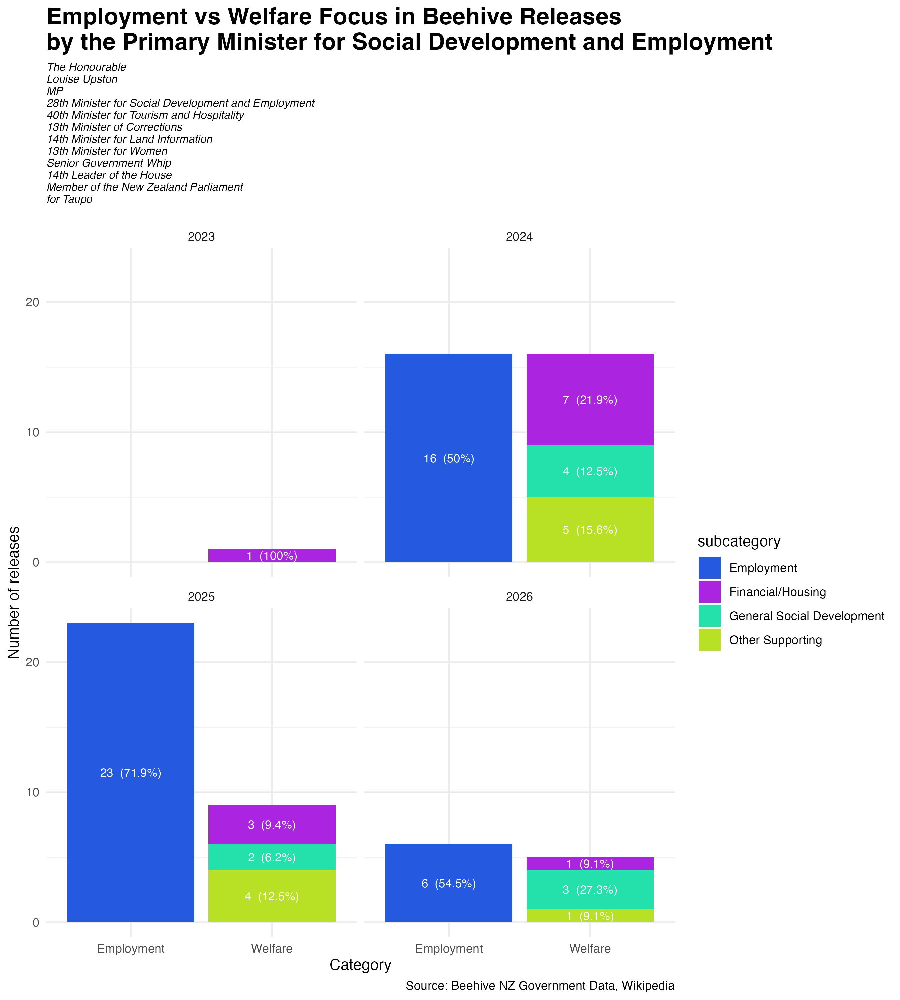

```{r setup, include=FALSE}
knitr::opts_chunk$set(echo = TRUE)
```


```{css echo=FALSE}
@import url('https://fonts.googleapis.com/css2?family=Host+Grotesk:ital,wght@0,300..800;1,300..800&family=Stack+Sans+Notch:wght@200..700&display=swap');

body {
  background-color: white;
  margin-top: 40px;
  margin-left: 23%;   
  margin-right: 23%;
  margin-bottom:50px;
}
h1{
  color:#2459E0;
  font-family: "Stack Sans Notch", sans-serif;
  font-weight: bold;
  text-transform: uppercase;
}
h2 {
  font-family: "Stack Sans Notch", sans-serif;
  font-weight: bold;
  text-transform: uppercase;
  padding-top:40px;
  padding-bottom:10px;
  color:#2459E0;
}

h3,h4 {
  font-family: "Stack Sans Notch", sans-serif;
  font-weight: bold;
  text-transform: uppercase;
  color:#24E0AB;
}

p {
  padding-top:13px;
  font-size: 15px;
  font-family: "Host Grotesk", sans-serif;
  padding-bottom:13px;
}

ul {
  font-family: "Host Grotesk", sans-serif;
  font-size: 14px;
  list-style-type: circle;
}

a:hover {
  text-decoration: underline;
  color: #31505b;
}

```

## Introduction

### Results I focused on

I focused on releases from the Social Development and Employment portfolio under the National/ACT/New Zealand First Coalition Government (2023–2026) on beehive.govt.nz.
<br>This resulted in a dataset of 79 Beehive releases.


I chose this portfolio because I was interested in understanding what kinds of issues are most commonly addressed in the Social Development and Employment contents.

In particular, I wanted to explore whether this portfolio is more focused on:

* employment-related issues (e.g. jobs, unemployment, workforce support), or
* social development issues (e.g. financial support, housing, families, and general social developing)

During initial exploration, I identified the primary minister responsible for this portfolio and observed that multiple ministers are associated with the releases in the dataset. To ensure a more focused analysis, I decided to concentrate on the primary minister and her releases for the Social Development and Employment portfolio, as other ministers often appear only in supporting or contextual roles rather than as independent contributors.

### Data referencing and requirements

The data used in this project was sourced from beehive.govt.nz, the official website for New Zealand government ministerial announcements, and supplementary minister information sourced from Wikipedia through the Wikipedia API.

Before collecting data, I reviewed the [Beehive robots.txt](https://www.beehive.govt.nz/robots.txt) file and the website’s copyright information.
The file disallows crawling of "/search/" paths associated with the website’s search system, but the exact search query URLs used in this project were not explicitly disallowed, and care was taken to only collect publicly accessible release data for research purposes.

All Beehive data used in this project is acknowledged as:

Source: New Zealand Government – [Beehive](https://www.beehive.govt.nz)

In addition, Wikipedia data was used to enrich minister information via the Wikipedia API for contextual information of minister roles.


## Visualisation

The main purpose of this visualisation is to analyse whether Beehive releases from the primary minister in the Social Development and Employment portfolio focus more on employment-related topics or broader welfare and social development issues during the National/ACT/New Zealand First Coalition Government (2023–2026), and how this focus changes over time.



To do this, I applied keyword-based text analysis to the titles and summaries of the releases, categorising them into Employment and Welfare themes. 

Employment-related keywords include terms such as *“employment”, “employer”, “unemployed”, “job”, and “work”*, while welfare-related keywords include *“welfare”, “financial”, “rent”, “children”, “support”, and “housing-related terms”*. Releases are classified based on a priority rule where titles are considered first, and summaries are used as additional context when necessary.

Further more it breaks down Welfare into subcategories, including *Financial/Housing, Other Supporting, and General Social Development* which provides a more detailed understanding of the types of social issues addressed within the portfolio over time.

The visualisation also includes a brief summary of the primary minister’s roles, sourced from Wikipedia, to provide contextual information. By focusing on releases attributed to the primary minister, the analysis compares the volume of releases across topic areas and over time, highlighting the proportion of policy focus within their communications. This may also provide an indication of the relative importance of different types of issues being addressed in New Zealand during this period.


## Creativity

The creativity of this visualisation lies in the integration of multiple datasets and analytical techniques to produce a meaningful interpretation of political communication.

At First, the Beehive dataset is enriched by linking it with ministerial role information sourced from Wikipedia. Data cleaning steps were performed, including separating multiple ministers associated with a single release and consolidating ministerial role descriptions into a single structured field for each minister using `paste()` with `collapse`. A left join was then used to combine the datasets while preserving all Beehive records. This integration allows contextual information about ministers’ responsibilities to be incorporated into the analysis.

Secondly, I tried a text classification approach using `case_when()` and `str_detect()` to classify releases based on keyword matching in both the title and summary fields. Titles were prioritised as they typically reflect the main focus of each release, while summaries were used as supplementary information. Releases were categorised into Employment and Welfare themes, with Welfare further divided into subcategories, providing a more detailed interpretation of policy focus.

For the visualisation design I used bar charts with percentage annotations and custom colour choices. Faceting by year allows the analysis to show how policy focus evolves over time, while simultaneously displaying both overall categories and subcategories within a single figure. I believe this improves interpretability and provides a more clear visual summary of thematic policy priorities across time. The inclusion of ministerial role information I extracted and cleaned up in the subtitle further contextualises the findings by linking policy output to ministerial responsibilities.


## Learning reflection

One important idea I learned from Module 5 is that data obtained from APIs (such as Wikipedia API requests) or scraped from websites (such as Beehive releases) often comes in an unstructured form and are rarely ready for analysis without significant cleaning and transformation.

For example, text fields may contain inconsistent formatting, multiple values combined into a single string, or irrelevant information that must be separated or removed. I also learned how important practical data manipulating techniques are, including also joining datasets from different sources, makes everything clearer is the aim when cleaning data needed so that it can be made into structured datasets that can support meaningful analysis and visualisation.

### Curiosity for further exploration

I am also interested in learning more advanced methods for cleaning and structuring raw text data, particularly techniques beyond simple keyword matching. I would wonder if it can automatically classify or summarise text in a more accurate and scalable way.

## Self review

Across the five projects, I believe I have developed important skills, particularly the ability to create, manipulate, and communicate data using modern data tools.

The first key skill I developed is data organizing and analysis using R and various pakages. <br>
Throughout the projects, I learned how to clean, transform, combine, and analyse datasets from a variety of sources and using tools such as `{dplyr}`, `{stringr}`, and `{ggplot2}` etc. to organise messy data into meaningful structures. These projects also helped deepen my understanding of statistics beyond simple calculations, as I learned how data preparation influence interpretation and conclusions.

The second key skill I developed is data visualisation. Compared with purely numerical analysis, I discovered that I particularly enjoy creating visual and interactive ways to present information. I appreciated learning how to transform data into clear and engaging visual outputs, including plots, styled HTML pages, and structured reports. Through the projects, I learned that good visualisation is not only about aesthetics, but also about helping better understanding for patterns, relationships, and stories within data. This course has helped me understand the importance of combining data analysis with creative technologies which helps communicate information more effectively.

Overall, the projects helped me see statistics not only as mathematical analysis, but also about creating meaningful and visually accessible interpretations from data.

## Appendix

```{r file='scrape_html.R', eval=FALSE, echo=TRUE}

```
```{r file='data_sources.R', eval=FALSE, echo=TRUE}

```
```{r file='visualisation.R', eval=FALSE, echo=TRUE}

```